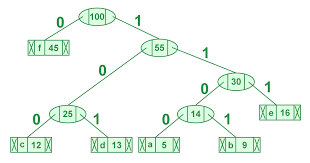

# Huffman Coding

Huffman coding is a lossless data compression algorithm that assigns variable-length codes to data symbols such that the length of the code is inversely proportional to the frequency of the data symbol. This means that symbols that appear more frequently in the data are assigned shorter codes, while symbols that appear less frequently are assigned longer codes.

The implementation of Huffman coding in this repository includes the following functions:

- `build_frequency_table(message)`: This function takes in a message as input and returns a dictionary that maps each character in the message to its frequency.

- `build_huffman_tree(frequency_table)`: This function takes in a frequency table as input and returns the root node of a Huffman tree that has been constructed from the frequency table.

- `build_encoding_table(node, val)`: This function takes in the root node of a Huffman tree and an initial value as input and recursively builds an encoding table that maps each character in the tree to its corresponding code.

- `encode(message)`: This function takes in a message as input, calls the other functions to build the frequency table, Huffman tree, and encoding table, and then uses the encoding table to encode the message. The encoded message is returned as output.

To use the Huffman coding implementation, simply call the `encode(message)` function with the message you want to encode as input. The encoded message will be returned as output.

# Here is how huffman coding works

